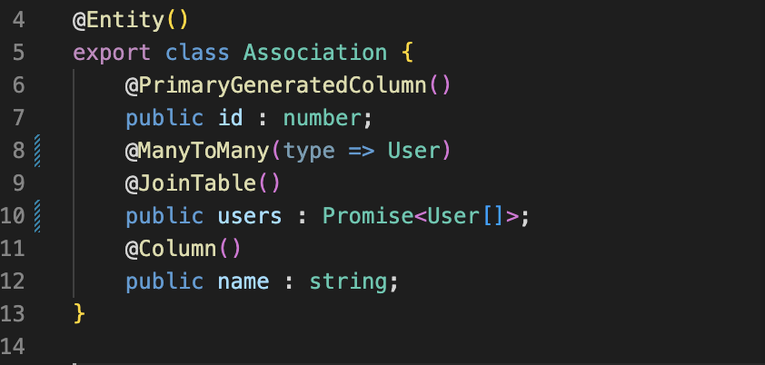
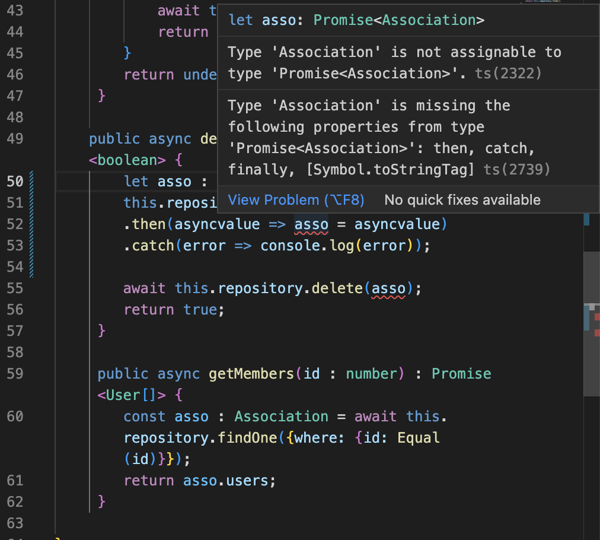
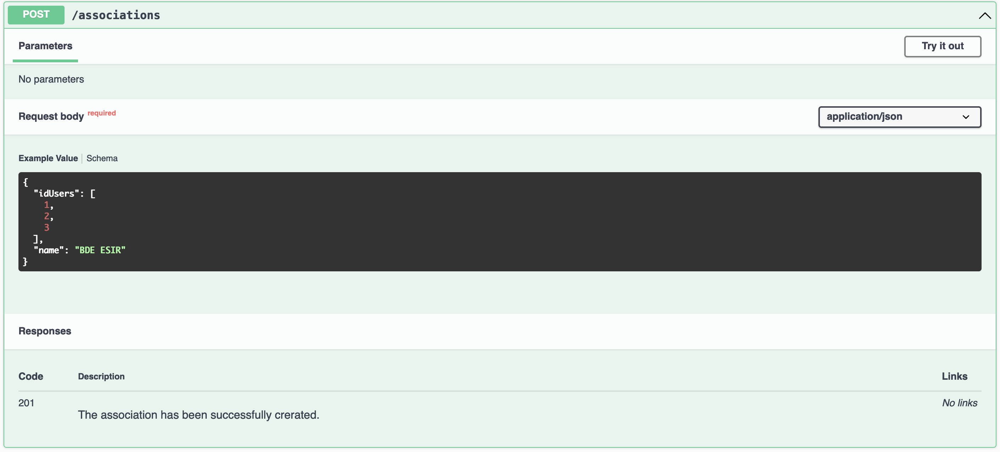
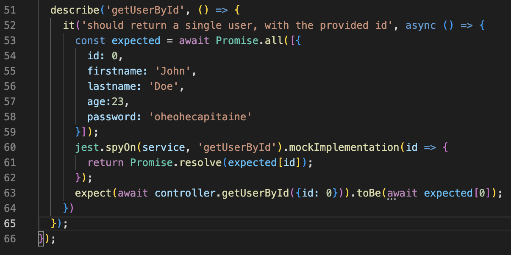
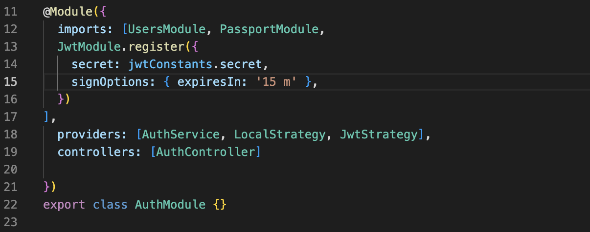

## Préambule 
Pour le back de notre projet, nous avons suivi le cours des TPs en essayant au maximum de faire des liens avec les notions tranmsises lors des cours magistraux.

## Fonctionnement 
Ainsi, pour lancer notre back, il vous suffit d'exécuter : 
```sh
npm run start:prod
```


## Choix d'implémentations 
Comme vous pourrez le constater, nous n'avons pas fait que naïvement suivre le cours des sujets, mais nous avons bien désiré les mettre en pratique :
### LazyLoading


Parfois contre vents et marées :


Nous avons voulu mettre le lazyloading en place pour nous confronter à des situations où les bases de données sont très larges.

### OpenAPI
Nous avons essayé d'appliquer le plus possible les outils inculqués. Chaque endpoint est expliqué et testable depuis notre API : 


### Tests
Seuls nos tests auraient pu être plus étendues. Ce choix du faible nombre de tests vient du fait que le dernier exemple était suffisant pour comprendre la logique résidant dans ces derniers. 


### Sécurité
En ce qui concerne la sécurité, nous avons considéré que la stratégie mise en place était déjà très robuste. 
Le seul bémol réside dans le fait que le JWT expire trop vite, nous avons donc allongé sa durée avant péremption à 15 minutes : 


## Conclusion

Nous avons donc mis en place un backend exhaustif. Nous avons là en main, une méthode solide pour nous permettre de constuire plus tard, des backend complets, testés et robustes face aux attaques.   

